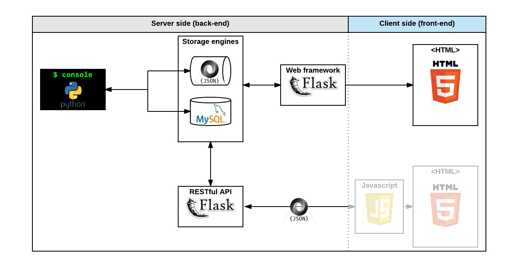

<div align="center">
<br>


</div>


<p align="center">


</p>


<h1 align="center"> AirBnB clone - RESTful API </h1>


<h3 align="center">
<a href="https://github.com/RazikaBengana/holbertonschool-AirBnB_clone_v3#eye-about">About</a> •
<a href="https://github.com/RazikaBengana/holbertonschool-AirBnB_clone_v3#hammer_and_wrench-tasks">Tasks</a> •
<a href="https://github.com/RazikaBengana/holbertonschool-AirBnB_clone_v3#memo-learning-objectives">Learning Objectives</a> •
<a href="https://github.com/RazikaBengana/holbertonschool-AirBnB_clone_v3#computer-requirements">Requirements</a> •
<a href="https://github.com/RazikaBengana/holbertonschool-AirBnB_clone_v3#keyboard-more-info">More Info</a> •
<a href="https://github.com/RazikaBengana/holbertonschool-AirBnB_clone_v3#mag_right-resources">Resources</a> •
<a href="https://github.com/RazikaBengana/holbertonschool-AirBnB_clone_v3#bust_in_silhouette-authors">Authors</a> •
<a href="https://github.com/RazikaBengana/holbertonschool-AirBnB_clone_v3#octocat-license">License</a>
</h3>

---

<!-- ------------------------------------------------------------------------------------------------- -->

<br>
<br>

## :eye: About

<br>

<div align="center">

**`AirBnB clone - RESTful API`** project is the third version of a four-part progressive implementation, centered on developing a robust **Flask-based RESTful API** to manage AirBnB-like resources such as `users`, `states`, `cities`, `places`, and `amenities`.
<br>
<br>
This iteration expands upon previous versions by offering a well-organized `API` with endpoints for performing `CRUD` operations on various entities, leveraging `SQLAlchemy` for optimized database interactions, and incorporating comprehensive unit tests to ensure the reliability and functionality of the backend service.
<br>
<br>
This project has been created by **[Holberton School](https://www.holbertonschool.com/about-holberton)** to enable every student to understand how to build a fully functional web application.
<br>
<br>
Through hands-on development of core components, we gain practical experience in backend systems, data modeling, software architecture, and front-end web development skills.

</div>

<br>
<br>

<!-- ------------------------------------------------------------------------------------------------- -->

## :hammer_and_wrench: Tasks

<br>

**`0. Restart from scratch!`**

**`1. Never fail!`**

**`2. Code review`**

**`3. Improve storage`**

**`4. Status of your API`**

**`5. Some stats?`**

**`6. Not found`**

**`7. State`**

**`8. City`**

**`9. Amenity`**

**`10. User`**

**`11. Place`**

**`12. Reviews`**

**`13. HTTP access control (CORS)`**

**`14. Place - Amenity`**

**`15. Security improvements!`**

**`16. Search`**

**`17. Documentation`**

<br>
<br>

<!-- ------------------------------------------------------------------------------------------------- -->

## :memo: Learning objectives

<br>

**_You are expected to be able to [explain to anyone](https://fs.blog/feynman-learning-technique/), without the help of Google:_**

<br>

```diff

General

+ What REST means

+ What API means

+ What CORS means

+ What is an API

+ What is a REST API

+ What are other type of APIs

+ Which is the HTTP method to retrieve resource(s)

+ Which is the HTTP method to create a resource

+ Which is the HTTP method to update resource

+ Which is the HTTP method to delete resource

+ How to request REST API

```

<br>
<br>

<!-- ------------------------------------------------------------------------------------------------- -->

## :computer: Requirements

<br>

```diff

Python Scripts

+ Allowed editors: vi, vim, emacs

+ All your files will be interpreted/compiled on Ubuntu 20.04 LTS using python3 (version 3.8.5)

+ All your files should end with a new line

+ The first line of all your files should be exactly #!/usr/bin/python3

+ A README.md file, at the root of the folder of the project, is mandatory

+ Your code should use the pycodestyle (version 2.7.*)

+ All your files must be executable

+ The length of your files will be tested using wc

+ All your modules should have documentation (python3 -c 'print(__import__("my_module").__doc__)')

+ All your classes should have documentation (python3 -c 'print(__import__("my_module").MyClass.__doc__)')

+ All your functions (inside and outside a class) should have documentation (python3 -c 'print(__import__("my_module").my_function.__doc__)' and python3 -c 'print(__import__("my_module").MyClass.my_function.__doc__)')

+ A documentation is not a simple word, it’s a real sentence explaining what’s the purpose of the module, class or method (the length of it will be verified)


Python Unit Tests

+ Allowed editors: vi, vim, emacs

+ All your files should end with a new line

+ All your test files should be inside a folder tests

+ You have to use the unittest module

+ All your test files should be python files (extension: .py)

+ All your test files and folders should start by test_

+ Your file organization in the tests folder should be the same as your project: ex: for models/base_model.py, unit tests must be in: tests/test_models/test_base_model.py

+ All your tests should be executed by using this command: python3 -m unittest discover tests

+ You can also test file by file by using this command: python3 -m unittest tests/test_models/test_base_model.py

+ We strongly encourage you to work together on test cases, so that you don’t miss any edge cases

```

<br>

- [unittest module](https://docs.python.org/3.4/library/unittest.html#module-unittest)

<br>

**_Why all your files should end with a new line? See [HERE](https://unix.stackexchange.com/questions/18743/whats-the-point-in-adding-a-new-line-to-the-end-of-a-file/18789)_**

<br>
<br>

### GitHub

<br>

There should be one project repository per group. <br>
If you clone/fork/whatever a project repository with the same name before the second deadline, you risk a 0% score.

<br>
<br>

<!-- ------------------------------------------------------------------------------------------------- -->

## :keyboard: More Info

<br>



<br>

### REST API:

<br>

[](https://www.youtube.com/watch?v=oB7IvffO7JI)

<br>
<br>

### Install Flask:

<br>

```
$ pip3 install Flask
```

<br>
<br>

<!-- ------------------------------------------------------------------------------------------------- -->

## :mag_right: Resources

<br>

**_Do you need some help?_**

<br>

**Concepts:**

* [AirBnB clone](https://drive.google.com/file/d/1-luATaTebPM71jcQYoz8o0fb-TIH-MTH/view?usp=sharing)

* [REST API](https://drive.google.com/file/d/1-l4LeN_6MQYDAoL7k32HWBL_q_lBB6lC/view?usp=sharing)

<br>

**Read or watch:**

* [Learn REST: A RESTful Tutorial](https://www.restapitutorial.com/)

* [Designing a RESTful API with Python and Flask](https://blog.miguelgrinberg.com/post/designing-a-restful-api-with-python-and-flask)

* [HTTP access control (CORS)](https://developer.mozilla.org/en-US/docs/Web/HTTP/CORS)

* [Flask cheatsheet](https://intranet.hbtn.io/rltoken/9CMkywW574lTxDsnEJcoVQ)

* [What are Flask Blueprints, exactly?](https://stackoverflow.com/questions/24420857/what-are-flask-blueprints-exactly)

* [Flask](https://palletsprojects.com/p/flask/)

* [Modular Applications with Blueprints](https://flask.palletsprojects.com/en/1.1.x/blueprints/)

* [Flask tests](https://flask.palletsprojects.com/en/1.1.x/testing/)

* [Flask-CORS](https://flask-cors.readthedocs.io/en/latest/)

* [AirBnB clone - RESTful API](https://www.youtube.com/watch?v=LrQhULlFJdU&feature=youtu.be)

<br>
<br>

<!-- ------------------------------------------------------------------------------------------------- -->

## :bust_in_silhouette: Authors

<br>

**${\color{blue}Razika \space Bengana}$**

<br>
<br>

<!-- ------------------------------------------------------------------------------------------------- -->

## :octocat: License

<br>

```AirBnB clone - RESTful API``` _project has no license specified._

<br>
<br>

---

<p align="center"><br>2022</p>